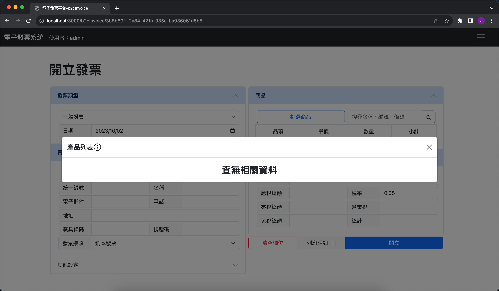
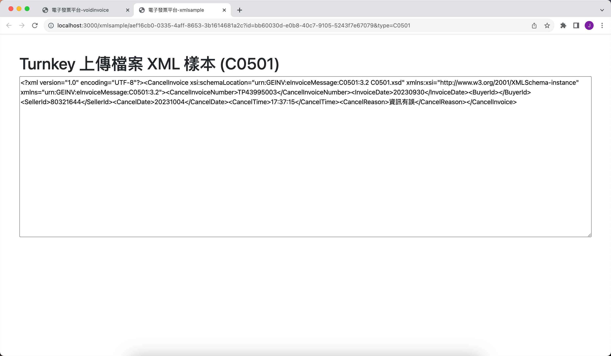

# 發票開立系統

一個簡單的網頁發票開立系統，用於店家自行列印發票與產生上傳到 turnkey 所需要的 xml 檔案。

[aws 測站](http://invoice.jason1231.com/)
AWS EC2 + AWS RDS

[vercel 測站](http://invoices.jason1231.com/)
vercel + ElephantSQL

兩測試站的檔案相同，但是 vercel 可能會有預期以外的錯誤～

API文件：[swagger文件](http://invoice.jason1231.com/api-docs)(尚未製作)

### 營業人資料

設定賣家資料，資料會帶入上傳的 xml 中的賣家資訊，下發抬頭設定代表發票列印時可選擇格式。
- **公司名稱**，代表上方直接顯示公司名稱
- **企業識別標章**，顯示公司的是圖標
- **自訂顯示名稱**，可以自行選擇要顯示的文字

### 票軌資訊

- 設定賣家電子發票票軌資訊，點 ＋ 號可以上傳電子發票票軌的 csv 檔案。
- 檔案來源請至電子發票整合服務平台申請，並下載檔案。
- 資料表上顯示票軌資訊，已狀態來區分可否使用，開立發票時會自動從使用中的發票抽取票號。
- 當基數月份時，會有提醒上傳空白未使用票軌。
- 上傳空白未使用票軌(尚未製作)

### 產品資訊

- 商品頁面可以新增產品，發票開立時都只能選擇以登入產品。

- 點選產品項目，可以顯示出以登入產品，並以類別分類。
- 點選產品可以將資料帶入欄位中，並修改。

- 修改產品名稱，可以一次性修該所以同類別的商品之類別。

### 客戶資訊

- 可以新增買家資訊，方便開立發票時填寫

- 搜尋欄位可以模糊搜尋，姓名、電話、手機、統編。
- 若沒有填寫，將搜尋所有客戶，客戶以列表方式顯示。
- 滑鼠靜置欄位上會顯示完整資訊

- 發票接收方式，代表買家希望發票的處理方式。
- 下方可以填寫每種發票接收方式的資訊，預設只會顯示該種類的發票資訊。

### 使用者資料

- 上方顯示使用者名稱，用狀態分類，登入者的名稱會以綠色顯示。
- 點選使用者名稱，可以將使用者資料帶入下方設定欄位。
- 選取需要權限，如果權限不足將無法顯示資訊，但是沒有權限一樣可以修改登入者自己的資料。
- 名稱代表登入帳號，修改密碼必須為登入者才可以修改，與權限無關。

- 設定所有相對應的權限

### 開立發票

- 發票開立畫面，發票類型可以選擇一般發票或是特種發票

- 買家資訊與買家設定相同，點選可以模糊搜尋相關買家資料，點選並帶入欄位中。

- 商品列表與商品頁面相同，可以顯示所有分類的商品。

- 右邊多一個搜尋匡，比對商品名稱或條碼，只搜尋關鍵字。

- 下方合計畫面會跟著選取的商品或稅率不同自動計算結果。
- 總計要大於零才可以開立發票
- 下方可以選擇是否列印明細

- 產生 xml 檔案給 turnkey 上傳，因為此為測試，所以直接回傳 xml 結果樣本。

- 產生發票的 PDF 樣式。

### 開立折讓單

- 填選發票號碼會自動帶入該張發票的資料與明細，點選欲折讓商品進行退貨或折扣行為。
- 可選擇是否要列印出明細。

- 明細樣式

- 產生 xml 檔案給 turnkey 上傳，因為此為測試，所以直接回傳 xml 結果樣本。

### 作廢發票

- 輸入作廢發票號碼，一樣會自動帶入發票資訊。
- 有折讓過的發票不可以作廢。
- 產生 xml 檔案給 turnkey 上傳，因為此為測試，所以直接回傳 xml 結果樣本。
### 作廢折讓單

- 輸入作廢折讓單號碼，一樣會自動帶入折讓單資訊。
- 產生 xml 檔案給 turnkey 上傳，因為此為測試，所以直接回傳 xml 結果樣本。

### 查詢發票
### 查詢折讓單
### 下載媒體申報檔

以下是測試